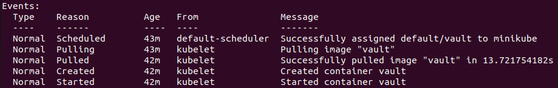

University: [ITMO University](https://itmo.ru/ru/)    
Faculty: [FICT](https://fict.itmo.ru)    
Course: [Introduction to distributed technologies](https://github.com/itmo-ict-faculty/introduction-to-distributed-technologies)    
Year: 2022/2023    
Group: K4110c    
Author: Ovcharov Evgenii Mihailovich    
Lab: Lab1    
Date of create: 28.10.2022    
Date of finished: 05.11.2022    
___
## Схема организации
Клиент отправляет запросы на 8200 порт. Этот порт прокинут внутрь кластера. Созданный сервис собирает информацию с этого порта и направляет в обслуживаемые поды (в данном случае 1 под - vault).    

___
## Ответы на вопросы
### 1. Что сейчас произошло и что сделали команды указанные ранее?
В результате выполнения работы был развернут под содержащий в себе docker image vault. Для этого был написан манифест и на его основе создан под с помощью команды: 
```bash
kubectl apply -f vault-pod.yaml
``` 
В результате был скачан образ vault и создан контейнер.    
    
Далее мы создали сервис для созданного пода: 
```bash
kubectl expose pod vault --type=NodePort --port=8200
``` 
Сервисы - абстракции над подами, определяющие как _достучаться_ до пода (или группы подов). Таким образом нам как пользователям (или другим частям системы) не нужно знать конкретные IP подов для взаимодействия с ними, а только IP обслуживающего их сервиса.    
Флаг _--type=NodePort_ устанавливает тип сервиса, NodePort позволяет связываться с сервисом из-за пределов кластера (из других Nodes).    
Флаг ```--port=8200``` устанавливает порт, который прослушивает сервис. Он переправляет все полученные на этом порту запросы на порт пода.    

Последняя команда: 
```bash
kubectl port-forward service/vault 8200:8200
```
Она укажет k8s какой порт прослушивать, и на какой порт внутри кластера передавать информацию (8200 - порт созданного сервиса).
___
### 2. Где взять токен для входа в Vault?
Воспользовавшись подсказкой выведем логи пода. Для этого используем команду:
```bash
kubectl logs <pod name>
```
В результате получаем:    
    
И в самом конце вывода находим необходимые токены:    
    
Вставляем найденный токен и мы вошли!    

___