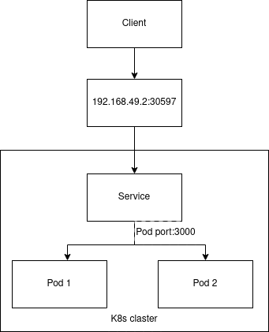
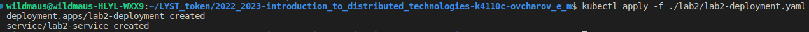
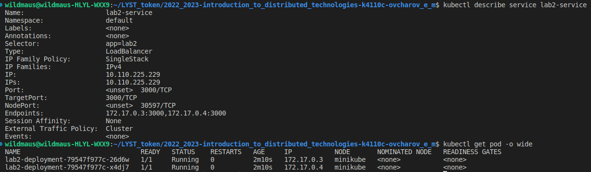
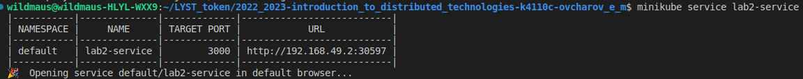
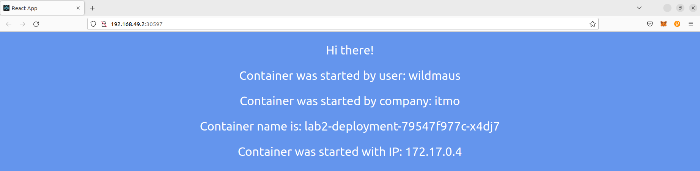
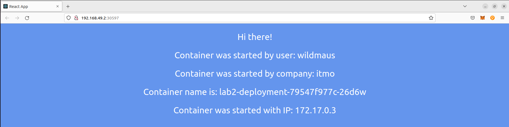
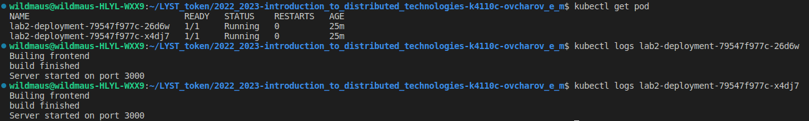

University: [ITMO University](https://itmo.ru/ru/)    
Faculty: [FICT](https://fict.itmo.ru)    
Course: [Introduction to distributed technologies](https://github.com/itmo-ict-faculty/introduction-to-distributed-technologies)    
Year: 2022/2023    
Group: K4110c    
Author: Ovcharov Evgenii Mihailovich    
Lab: Lab2    
Date of create: 29.10.2022    
Date of finished: 05.11.2022    
___
## Схема организации
    
___
## Скриншоты
### 1. Запуск
Запустим сервис и deployment:
```bash
kubectl apply -f lab2-deployment.yaml
```

### 2. Проверка
После чего проверим корректность созданных подов и сервиса:
```bash
kubectl descibe service lab2-service
kubectl get pod -o wide
```
Как видно из скрина _Endpoints_ сервиса совпадают с IP созданных подов.    
    
Для работы выбран тип сервиса LoadBalancer. Для раскрытия сервиса в данном случае используется определенный выделенный IP адрес, информация с порта которого будет поступать в сервис. Для получения такого IP:
```bash
minikube service lab2-service
```
    
Зайдем на полученный url:    
    
    
Как видно из скринов выше `REACT_APP_USERNAME` и `REACT_APP_COMPANY_NAME` остаются неизменными, т.к. это переменные переданные из манифеста при создании подов. А вот `Container name` изменяется, т.к. сервис распределяет нагрузку между сущестующими репликами. 
### 3. Логи контейнеров
