University: [ITMO University](https://itmo.ru/ru/)
Faculty: [FICT](https://fict.itmo.ru)
Course: [Introduction to distributed technologies](https://github.com/itmo-ict-faculty/introduction-to-distributed-technologies)
Year: 2022/2023
Group: K4110c
Author: Ovcharov Evgenii Mihailovich
Lab: Lab3
Date of create: 30.10.2022
Date of finished: 
___
## Схема организации
В данном случе (в отличии от предыдущих) в схеме дополнительно появляется `Ingress`. Он позволяет обслуживать определенный _domain address_, переправляя все запросы, поступающие на него, на указанные сервисы (может обсуживать сразу несколько, что будет продемонстрированно позже).    
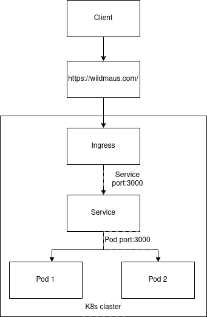    
___
## Скриншоты
### 1. Запуск
Запустим все необходимые компоненты:
```bash
kubectl apply -f lab3-configmap.yaml
kubectl apply -f lab3-replicaset.yaml
kubectl apply -f lab3-service.yaml
```
После чего сгенерируем TLS серитификат, сохраним его в качестве секрета в k8s и запустим ingress:
```bash
openssl req -x509 -newkey rsa:4096 -sha256 -nodes -keyout tls.key -out tls.crt -subj "/CN=wildmaus.com" -days 20
kubectl create secret tls test-tls --cert=tls.crt --key=tls.key
kubectl apply -f lab3-ingress.yaml
```
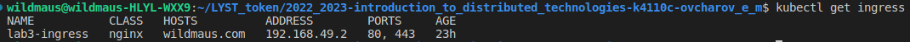    
После чего прописываем FQDN в hosts:
```bash
sudo nano /etc/hosts
```
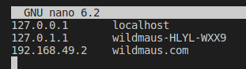
### 2. Проверка
Проверим что все созданно корректно 
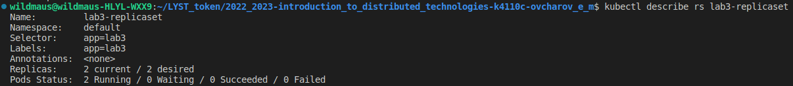    
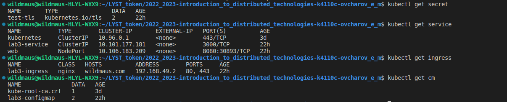
### 3. Проверка в браузере
К сожалению в браузере не отображается результат работы, загружается только иконка React. Сертификат при этом действителен.    
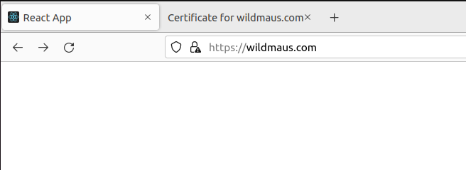    
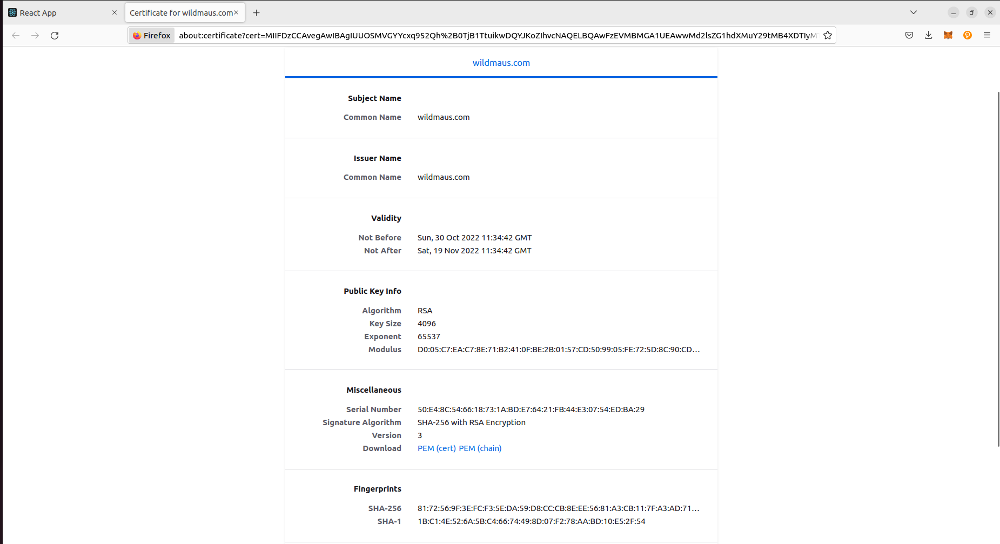    
Проверил через curl:
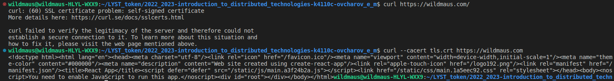    
Предположительно проблема в самом приложении. Для проверки добавил сервису `type: LoadBalancer` и зашел на него напрямую. Все работает корректно.
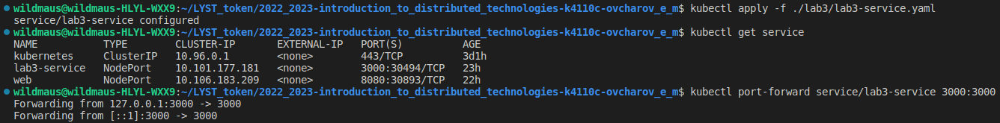    
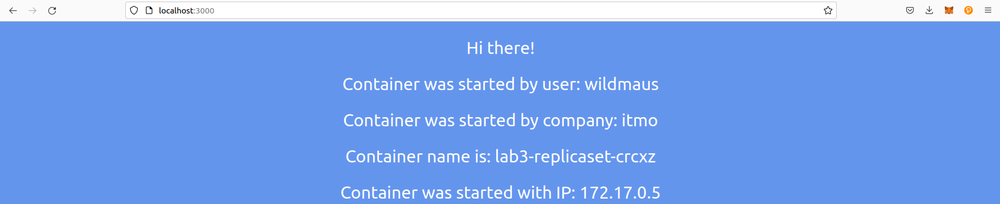    
Следующим предположением было что проблема в ingress. Для проверки решил добавить в ingress другой сервис, нашел _hello world_ image. Cоздал deployment и сервис для него.
```bash
kubectl create deployment web --image=gcr.io/google-samples/hello-app:1.0
kubectl expose deployment web --type=NodePort --port=8080
```
Проверил что все работает:    
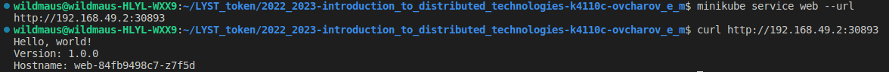    
Добавил сервис в ingress на другой url - /hello. Проверил что все работaет из браузера, исходный контейнер все еще не работает, а вот hello - отлично:    
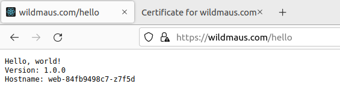    
Проверил описание ingress, все корректно.    
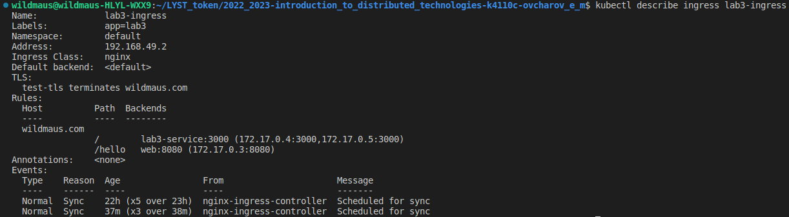    
### 4. Починил
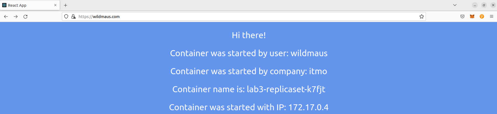    