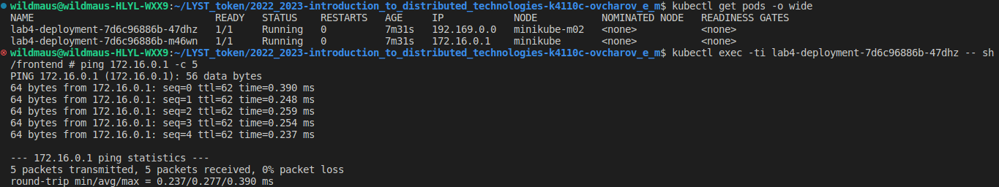

University: [ITMO University](https://itmo.ru/ru/)    
Faculty: [FICT](https://fict.itmo.ru)    
Course: [Introduction to distributed technologies](https://github.com/itmo-ict-faculty/introduction-to-distributed-technologies)    
Year: 2022/2023    
Group: K4110c    
Author: Ovcharov Evgenii Mihailovich    
Lab: Lab4    
Date of create: 31.10.2022    
Date of finished: 
___
## Схема организации
    
___
## Скриншоты
### 1. Запуск
Сначала попытался запустить используя встроенный в minikube calico:    
```bash
minikube start --nodes 2 --cni calico
```
Проверка результата - оба узла запущены:    
    
    
А вот с calico-nodes возникли пробемы:    

    
В результате встроенный calico не работает, поэтому было решено использовать способ установки через манифест:
```bash
minikube start --nodes 2 --network-plugin cni
kubectl apply -f https://raw.githubusercontent.com/projectcalico/calico/v3.24.3/manifests/calico.yaml
```
Этот способ сработал:    
    
## 2. Установка labels
Для указания `labels` установим calicoctl:
```bash
kubectl apply -f https://raw.githubusercontent.com/projectcalico/calico/v3.24.3/manifests/calicoctl.yaml
alias calicoctl="kubectl exec -i -n kube-system calicoctl -- /calicoctl"
```
Далее после удаления `default-ipv4-ippool` установим `labels` по признаку стойки:  
```bash
kubectl label nodes minikube rack=0
kubectl label nodes minikube-m02 rack=1
```
    
После чего создадим IP pool для каждой стойки:    
```bash
calicoctl create -f  - < lab4-ippool.yaml
```
    
### 3. Deployment
Аналогично lab2 создадал service типа `LoadBalancer`. `Container name` и `Container IP` изменяются, так как сервис распределяет нагрузку между двумя репликами. При этом по 3ей цифре IP можно понять на реплику какой "стойки" был направлен запрос.    
    
    
Заметил на скринах, что что-то не так. IP контейнеров не соответствуют назначенным пулам - проблема в том что calico не работает, долго разбирался как решить. В итоге нашел способ запустить все корректно. Для этого изменил конфигурацию `NetworkManager`, запустил minikube c другой версией kubernetes.
### 4. Начиная все сначала
Для запуска использую следующую команду:
```bash
minikube start --nodes 2 --container-runtime containerd --cni calico --kubernetes-version=v1.24.3
```
Что дало корректный результат:    
    
    
Версия встроенной calico - v3.20.0, не нашел скприпта для calicoctl для этой версии. Для решения создал _calicoctl.yaml_ с нужной версией.    
Теперь удалим существующий IP пул, добавим новые и проставим лейблы для узлов:    
```bash
kubectl apply -f calicoctl.yaml
calicoctl delete ippools default-ipv4-ippool
kubectl label nodes minikube rack=0
kubectl label nodes minikube-m02 rack=1
calicoctl create -f  - < lab4-ippool.yaml
```
    
Аналогично шагу 3 создаем `deployment` и прокидываем порты:
    
    
В результате `Container IP` соответствует выделенным пулам для нод: *172.16.0.1* для стойки 0, *192.169.0.0* для стойки 1 :pinched_fingers:. `Container name` изменяется, т.к. сервис распределяет нагрузку на разные поды.    
### 5. Ping
Зайдем в под и попингуем другой:
```bash
kubectl get pods -o wide
kubectl exec -ti lab4-deployment-7d6c96886b-47dhz -- sh
```
    